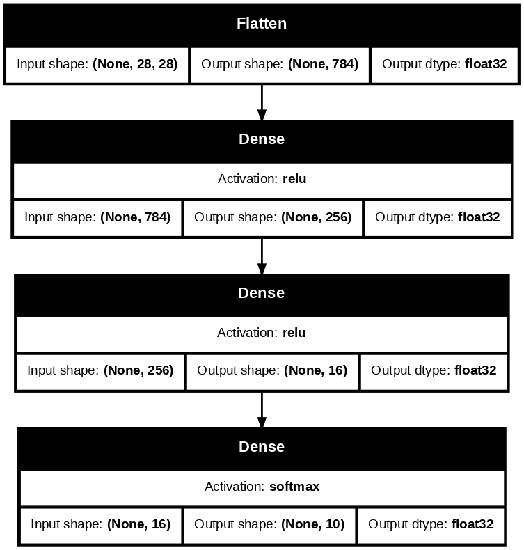
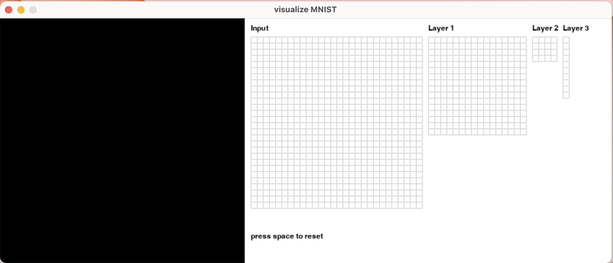

# README

This project is inspired by one of the follow-up ideas in assignment 7 that we could make machine learning more accessible and understandable through data visualization. We built an interactive demo to demonstrate how neural network process data to make predictions on handwritten numbers.

## About
We trained a 3-layer neural network on the MNIST dataset [[code]](https://github.com/csci-596-24fall/visualize-handwritten-number-recognition/blob/main/src/MNIST.ipynb) and exported 
 weights and biases in each layer [[data]](https://github.com/csci-596-24fall/visualize-handwritten-number-recognition/tree/main/src/data).



With the exported data, we calculate the output of each layer and visualize each layer using PyOpenGL and PyGame.



## Dev
### Setup
Prerequisite:
- Python >= 3.3
- pip

1. create a virtual env (venv)
```sh
cd <PROJECT_ROOT>
python3 -m venv .venv
```

2. [activate venv](https://docs.python.org/3/library/venv.html#how-venvs-work)
```sh
# in project root
source .venv/bin/activate
```

3. install dependency
```sh
pip install -r ./requirements.txt
```

### Run
#### Method 1: by script
```sh
cd <PROJECT_ROOT>
./script/run.sh
```

#### Method 2: manually
```sh
cd <PROJECT_ROOT>

# activate venv
source .venv/bin/activate

# run main file
python3 src/main.py
```

### Train
Open `src/MNIST.ipynb` and run, highly recommend using Google Colab.
